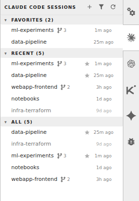

# jupyterlab_ai_code_assistants_extension

[](https://github.com/stellarshenson/jupyterlab_ai_code_assistants_extension/actions/workflows/build.yml)
[](https://www.npmjs.com/package/jupyterlab_ai_code_assistants_extension)
[](https://pypi.org/project/jupyterlab-ai-code-assistants-extension/)
[](https://pepy.tech/project/jupyterlab-ai-code-assistants-extension)
[](https://jupyterlab.readthedocs.io/en/stable/)
[](https://kolomolo.com)
[](https://www.paypal.com/donate/?hosted_button_id=B4KPBJDLLXTSA)

A full launcher and manager for every AI code assistant in JupyterLab - Claude Code, Codex, Kimi and Gemini. Start, resume, fork, switch, and clean up CLI sessions from a side panel per assistant - one click lands you in the right terminal with the assistant already running, no duplicate tabs, no UUID hunting. One install replaces the separate `jupyterlab_claude_code_extension`, `jupyterlab_codex_extension` and `jupyterlab_kimi_code_extension` packages and migrates their settings and favourites automatically.



## Why this extension

One principle: **the vendors know best how to build the agent harness; we know best how to make it work in JupyterLab.**

Chat-panel extensions re-implement the agent loop and trail the real tool. This one runs the genuine, unmodified CLIs in JupyterLab terminals - skills, subagents, MCP, hooks, plan mode, every release the day it lands. The extension owns the JupyterLab side:

- **Launching** - new, resumed, or forked sessions, with or without permission prompts, no wrapper shell, correctly sized before the assistant draws its first frame
- **Finding** - every project in one panel per assistant: favourites, search, live activity
- **Reusing** - clicking a session focuses its existing terminal, never a duplicate
- **Managing** - parallel conversations: switch, fork with a name, delete - no `--resume` pickers, no raw UUIDs

## Features

- **One install, every assistant** - Claude Code, Codex, Kimi and Gemini from a single package, each with its own right-side panel wearing its official mark
- **Provider registry** - assistant-specific behaviour lives in one module per assistant behind capability flags; no core file names an assistant, and adding one touches no core file
- **Joint settings page** - one settings section covering all assistants, with a per-assistant toggle (all on by default); toggling takes effect live, no JupyterLab reload
- **Three-section side panel** - Favorites, Recent, and All projects, each scrolling independently
- **One-click resume** - click a row to jump back into that session in a terminal; an open terminal for the project is reused instead of duplicated
- **Conversation switcher** - a right-click "Switch and Manage Sessions" submenu lists a project's other conversations by name and short id with last-activity time; "Manage Sessions..." opens a searchable popup over the full list with multi-select delete and per-row open and copy-id buttons
- **Branch session** - fork the current conversation into a new named session via the right-click menu; each assistant forks its own way (Claude's native `--fork-session`, Codex's `codex fork`, server-side copies for Kimi and Gemini) behind the same menu item
- **Launch modes under each assistant's own name** - Claude's skip-permissions, Codex's approval bypass, Kimi's `--yolo`, Gemini's YOLO and approval modes; unsafe variants carry a warning glyph
- **Coloured terminal tabs** - each session's colour tints its terminal tab via the companion `jupyterlab_colourful_tab_extension` (installed automatically). Assistants without a colour concept get a stable colour from the extension's own store, and a branched session inherits its parent's colour
- **Favorites** - star projects you keep coming back to via the right-click menu; favourites from the standalone extensions are migrated on first run
- **Remove and clean up** - drop a project's history or a project's extra parallel sessions from the right-click menu, confirmation dialog first; removed files honour JupyterLab's "move files to trash" setting
- **Activity at a glance** - each row shows its last activity in an aligned column; rows active within the last minute light up, rows idle for over a week dim, and rows with parallel conversations show a branch icon with the count
- **Remote control indicator and background agents** (Claude) - a green dot marks sessions actively under remote control, and a conversation held by a running background agent shows a `bg` chip; clicking attaches to the agent instead of copying it
- **Search** - fuzzy filter per panel, toggled by the funnel button
- **Presentation modes** - label rows by session name, folder name, or path relative to the JupyterLab root
- **Conflict-safe upgrade** - if a retired standalone extension is still installed, its panel wins and this extension stands down for that assistant instead of showing a duplicate
- **Auto-disabled when absent** - an assistant whose CLI is not on `PATH` does not show a panel

## Requirements

- JupyterLab >= 4.0.0
- Python >= 3.10
- At least one assistant CLI on `PATH`: `claude`, `codex`, `kimi`, or `gemini`

## Install

Developers must install via the project `Makefile` (which orchestrates clean, build, and pip install of the resulting wheel):

```bash
make install
```

End-users can install the published package from PyPI:

```bash
pip install jupyterlab_ai_code_assistants_extension
```

> [!WARNING]
> `package.json` pins `webpack: 5.106.0` and `chalk: 4.1.2` in both `resolutions` and `overrides`. Do not remove these. webpack `>= 5.106.1` changed its module-federation share identifier format and crashes the unmaintained `license-webpack-plugin` (`split('=')[1].trim()`) that `@jupyterlab/builder` injects into every production build; the duplicate `chalk@2.4.2` pulled by `duplicate-package-checker-webpack-plugin` crashes on Node 24+ in the build-isolation install. Without the pins, `make publish` and CI fail on `python -m build`.

## Migrating from the standalone extensions

This package supersedes `jupyterlab_claude_code_extension`, `jupyterlab_codex_extension` and `jupyterlab_kimi_code_extension`. On first run it carries their settings and favourites over automatically; uninstall the standalones once you are ready:

```bash
pip uninstall jupyterlab_claude_code_extension jupyterlab_codex_extension jupyterlab_kimi_code_extension
```

While a standalone extension is still installed, its panel is shown and this extension's panel for that assistant stays out of the way.

## Uninstall

```bash
pip uninstall jupyterlab_ai_code_assistants_extension
```
